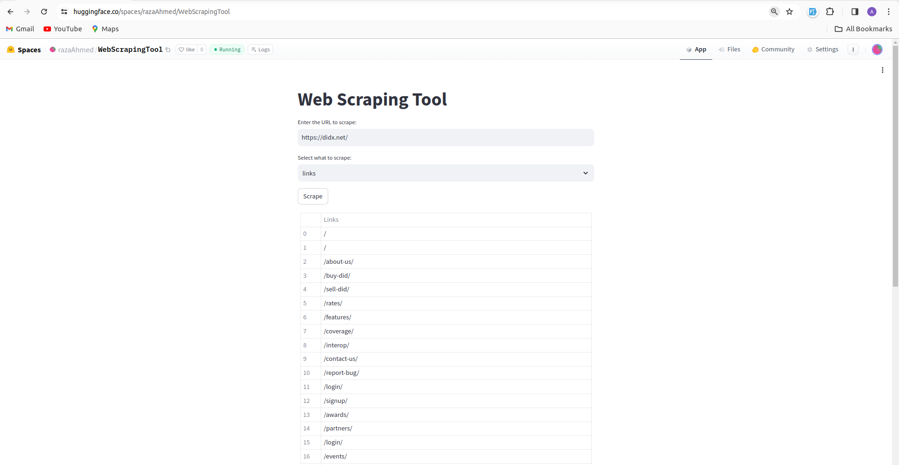

The Web Scraping Tool is an application designed to offer a convenient interface for users to extract information from websites. By entering the URL of a target website, users can choose between two scraping options: retrieving data or collecting links. Here's what the program offers:

SSL Handling: The tool uses urllib3 PoolManager to manage SSL connections, ensuring that secure HTTPS requests can be made without issues.

User-Friendly Interface: Developed with Streamlit, the tool provides a simple and interactive user interface, making it straightforward for non-technical users to perform web scraping tasks.

Flexibility in Data Retrieval: Users have the option to choose the kind of data they want to scrape:

Data: Extracts and displays all the text content from the page in a clean, structured format.
Links: Collects all hyperlinks (anchor tags) present on the webpage and lists their href attributes.
Real-time Feedback and Results: As soon as the "Scrape" button is clicked, the program processes the request and presents the results in a table within the Streamlit interface.

Error Handling: The application handles different scenarios gracefully – including unsuccessful HTTP requests or unexpected errors – and informs the user about the issue.

This tool is ideal for users who need to quickly gather textual content or a list of links from any given webpage without worrying about coding or the complexities of web scraping.

https://huggingface.co/spaces/razaAhmed/WebScrapingTool